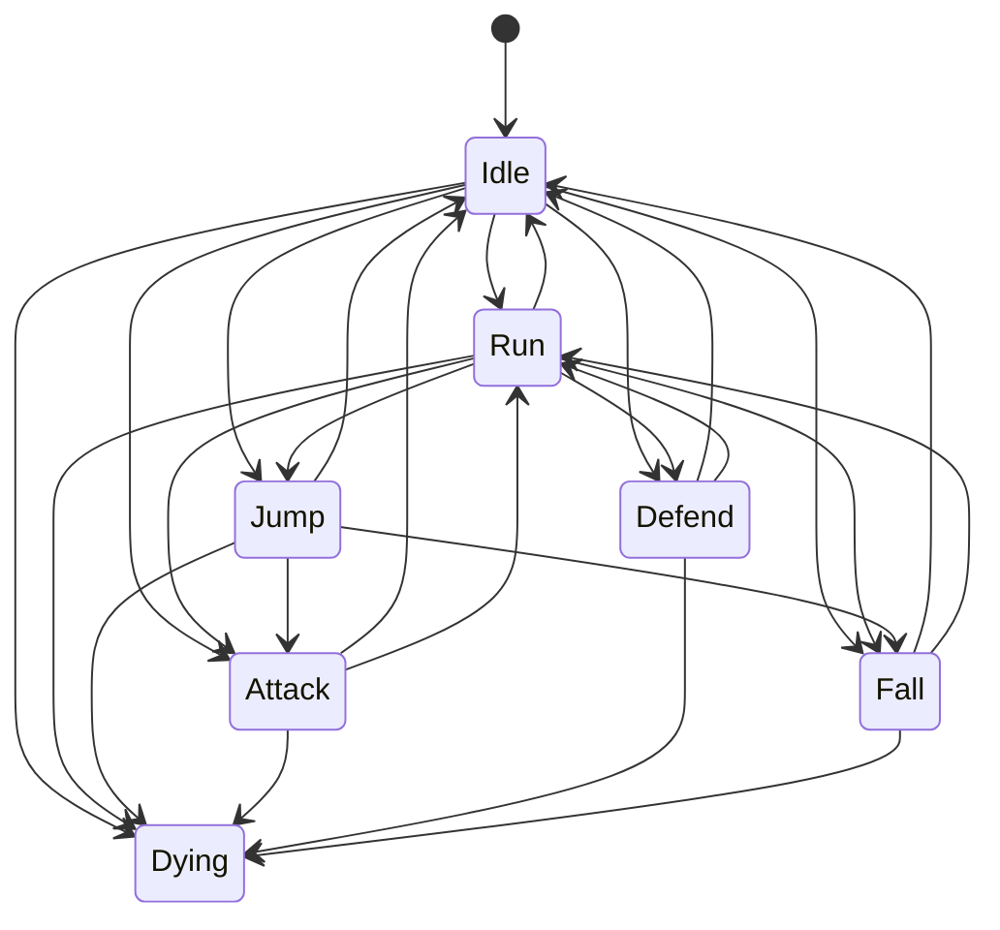
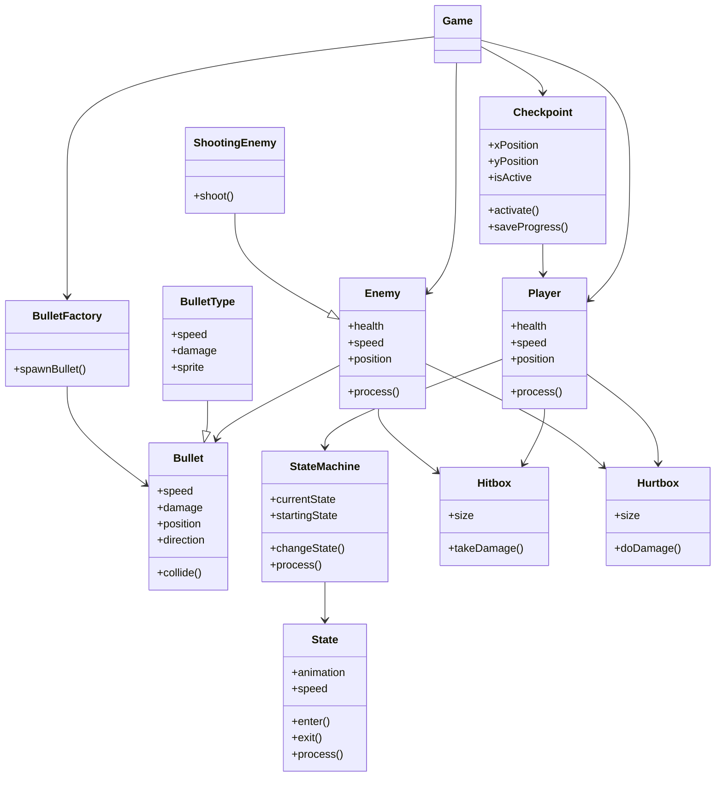

# Final Project

# Name TBD

### ✒️ Description

This is a 2D platformer game where the player controls a character tasked with navigating through various levels filled with enemies and obstacles. The main character has the ability to attack and deflect bullets from enemies. The objective is to reach the end of the level without dying, while utilizing checkpoints placed throughout the level to save progress. The player must defeat enemies, avoid hazards, and the deflection mechanic to progress through the challenging environment.

### 🕹️ Gameplay

The player controls the main character, who can move left and right, jump, attack, and defend. The game consists of different types of enemies that shoot bullets at the player. The player can deflect these bullets back at the enemies.

In each level, there are checkpoints scattered along the way. When the player reaches a checkpoint, their progress is saved, and if the player dies, they respawn at the last checkpoint. The goal of each level is to reach the end.

Enemies vary in behavior, some can shoot and other cannot. The enemies will have diiferent speeds and health, and also the shooting mechanics can vary between different enemies.

There are also some platforming aspects the player must traverse, or they might fall and lose the game.

## 📃 Requirements

1. The player will be able to move, jump, attack, and defend.
2. The player can attack enemies to kill them.
3. The player can deflect the bullets of the enemies, which will do damage to the enemies, they can deflect straight back or upwards, depending on the keys they are holding when deflecting.
4. Enemies will be able to move and shoot.
5. Enemies and the plyaer will have health that will go down when damaged.
6. There will be checkpoints in the level that will save progress.
7. If the player dies they will go back to the last checkpoint.
8. There will be multiple types of enemies.
9. The different enemies will vary in looks, health, damage, speed, and behaviour.
10. The system will restart the game if the player dies before reaching a checkpoint.
11. The system will display player health.
12. The goal of the game will be to navigate through the level and reach the end without dying.
13. The game will include platforms the player must traverse, with falling resulting in losing the game.
14. The player will have multiple attack animations.
15. There will be multiple types of bullets.
16. MAYBE: The system will have puzzles that will work with the bullet deflection mechanic.

### 🤖 State Diagram

### 🗺️ Class Diagram

### 🧵 Wireframes

### 🎨 Assets

The assets used will be 2d assets found on websites such as [Itch.io](https://itch.io) that allow others to use their assets. This includes character srpites and animations, background images, and tile-sets.

#### 🔊 Sounds

There will be background music playing throughout the game, and sounds when the player is hit or hits an enemy, as well as any other interaction needing sound.
